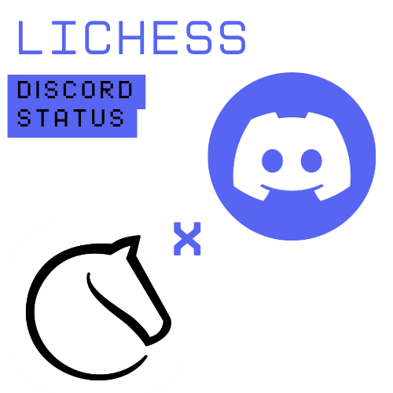
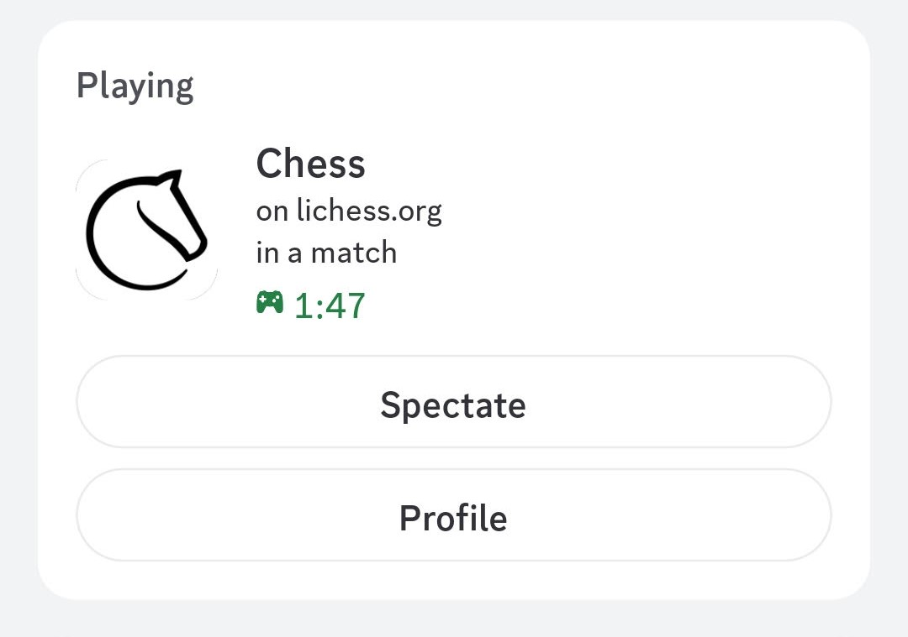

# Lichess-Discord-Status

Translate your Lichess activity into your Discord status.


This project allows you to display your current Lichess status directly on your Discord profile using Rich Presence. It automatically updates whether you are online or in a game, and provides links to your profile or the current game.



## Features

* **Dynamic Status:** Shows if you are online or currently in a Lichess match.
* **Profile Link:** Includes a button on your Discord status linking directly to your Lichess profile.
* **Spectate Button:** If you are in a game, a button appears allowing others to spectate your current match.

## Technologies Used

* **pypresence:** A Python library used to update Discord's Rich Presence information.
* **Custom Lichess Class:** A custom-built Python class to interact with the Lichess API to fetch your status.

## Installation

1.  Clone this repository or download the source code.
2.  Navigate to the project directory in your terminal or command prompt.
3.  Install the required Python libraries using pip:

    ```bash
    pip install -r requirements.txt
    ```

## Configuration

1.  Locate the `config.json` file in the project directory.
2.  Edit `config.json` and replace `"yourLichessUsername"` with your actual Lichess username:

    ```json
    {
      "lichessUsername": "yourLichessUsername",
      "debugMode": 0
    }
    ```
3.  **(Optional)** To enable debug mode, change `"debugMode": 0` to `"debugMode": 1`.

## Usage

After installing the requirements and configuring `config.json`, run the main Python script:

```bash
python main.py
```

## Batch File (Optional)

For added convenience, I included a batch file, `open_lichess.bat`, that automatically:
1.  Opens lichess.org in your default web browser.
2.  Launches the `main.py` script to start updating your Discord status.

You can create a shortcut to this batch file for easy access.